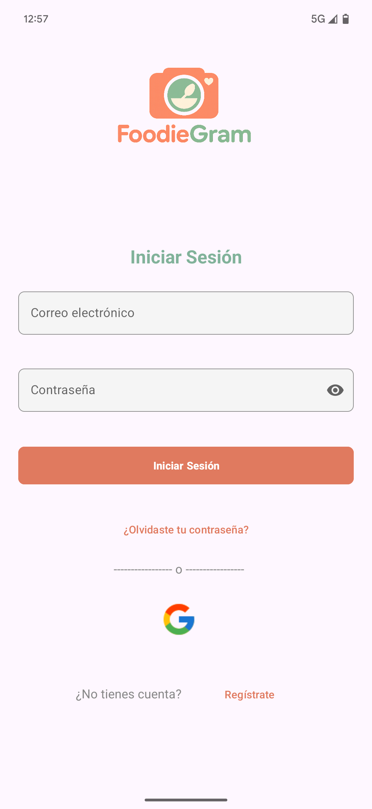
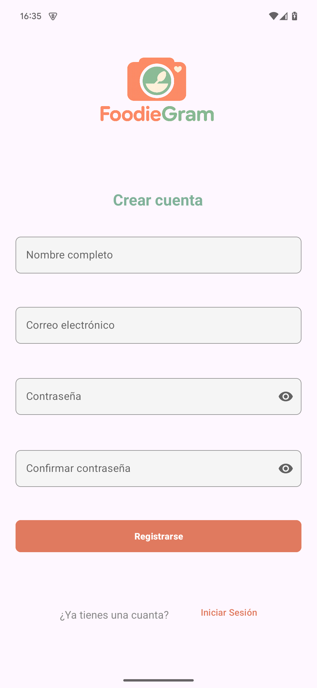
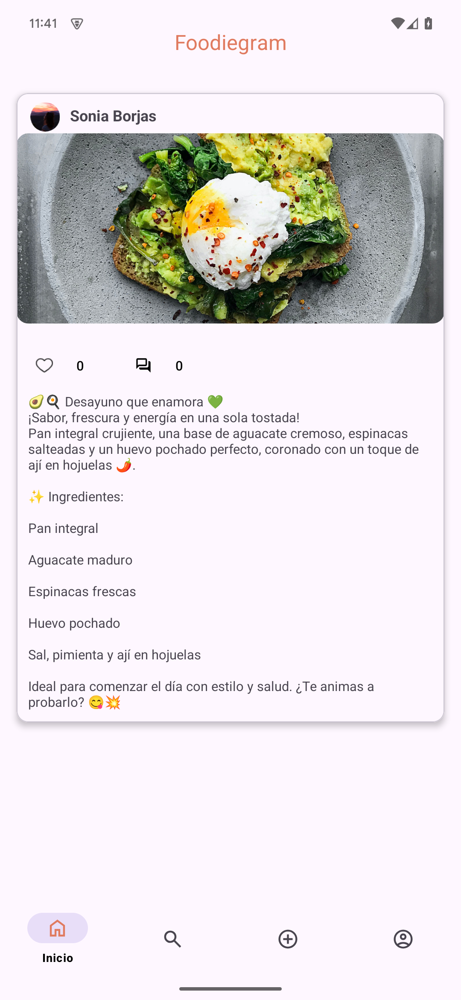
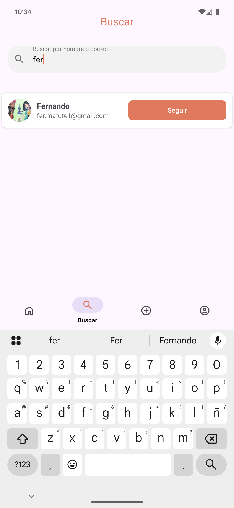
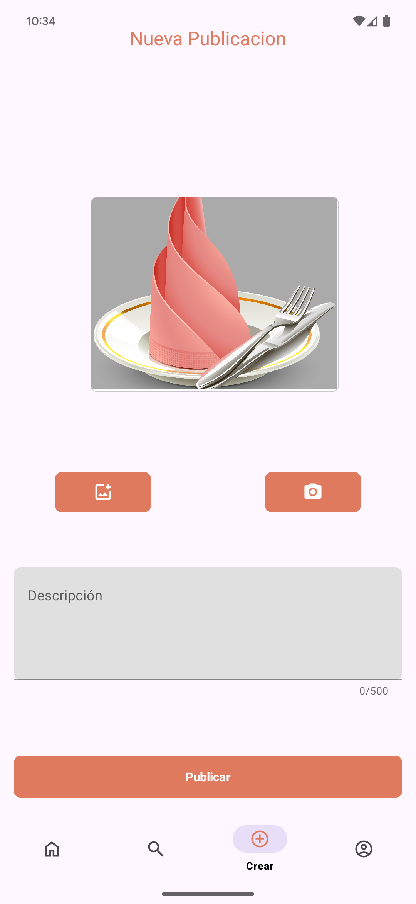
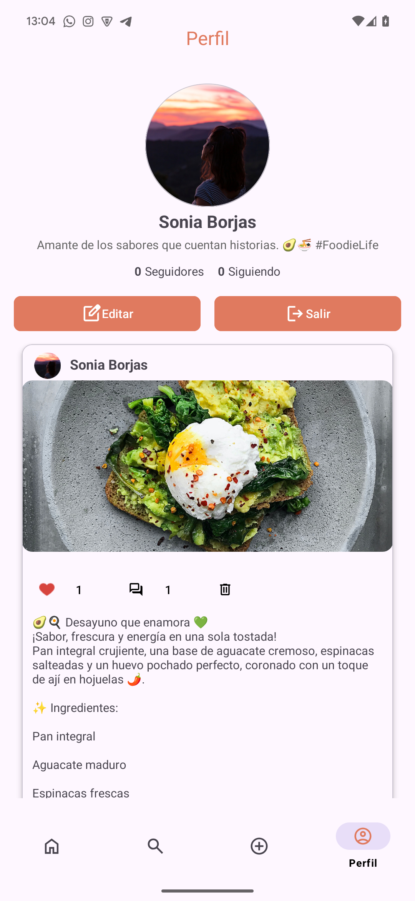

# **🍽️  FoodieGram**

**FoodieGram** es una app para móviles pensada para quienes disfrutan compartiendo lo que comen. Ya sea un plato que hayas cocinado tú o algo que te haya encantado en un restaurante, aquí puedes subir fotos, añadir una descripción y ver lo que publican otros usuarios. La idea es crear una especie de red social centrada en la comida, donde lo importante no es solo comer bien, ¡sino también compartirlo!

---
## **📱 Características principales**
- 📸 Subida de publicaciones con imagen y descripción
- 💬 Comentarios y sistema de "me gusta"
- 🔍 Búsqueda de usuarios por nombre o correo
- 👤 Edición de perfil y foto
- 🔐 Autenticación de usuarios (email/contraseña + cuenta Google)
- 📥 Almacenamiento en la nube para imágenes
- 🔄 Navegación mediante `BottomNavigationView` y Fragments
---

## 🛠️ Tecnologías utilizadas

| Herramienta        | Uso                                      |
|--------------------|------------------------------------------|
| **Java**           | Lógica y desarrollo de la app Android    |
| **Android Studio** | Entorno de desarrollo (IDE)              |
| **Firebase**       | Autenticación y base de datos (Firestore)|
| **Supabase**       | Almacenamiento de imágenes (Storage)     |
| **Glide**          | Carga y caché de imágenes                |
| **GitHub**         | Control de versiones                     |
| **MVVM**           | Arquitectura del proyecto                |

---

## 📂 Estructura del proyecto
FoodieGram/
├── ui/ # Fragments y pantallas
├── model/ # Clases de datos (Usuario, Publicacion, Comentario)
├── viewmodel/ # Lógica de presentación con LiveData
├── data/ # Repositorios y conexión con Firebase/Supabase
├── util/ # Clases auxiliares

---

## 🚀 Instalación
La app puede instalarse mediante un archivo APK que puedes descargar desde el código QR

Asegúrate de tener:
- Android 8.0 o superior (recomendado: Android 15+)
- Conexión a internet para acceder a Firebase y Supabase

---
## 🧪 Usuario de prueba
📧 prueba@gmail.com
🔐 hola123

---

## 🎯 Futuras mejoras
- Notificaciones push
- Comentarios con imágenes
- Etiquetas por tipo de comida
- Sistema de seguidores y perfil público
- Geolocalización de publicaciones
- Versión multiplataforma (Flutter o React Native)
---

## 📸 Capturas de pantalla
- Login

- Crear cuenta

- Pantalla principal

- Busqueda

- Publicación

- Perfil de usuario

---
